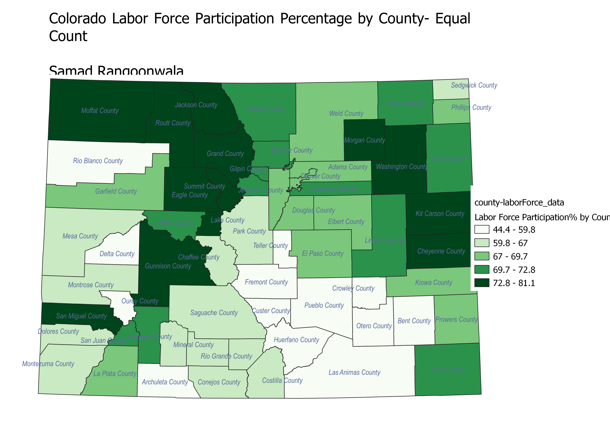
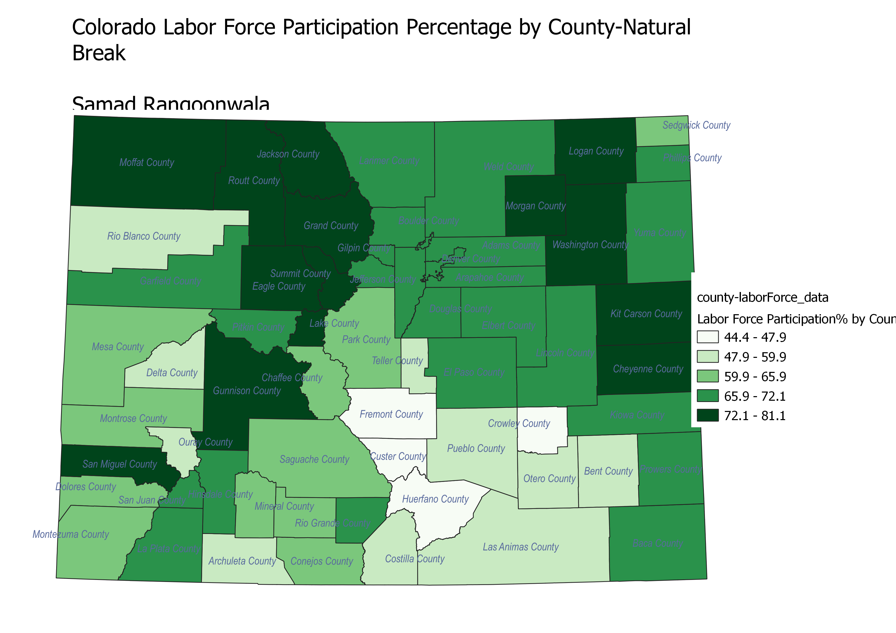

# Hw 6.2

<html lang="en">
<head>
    <meta charset="UTF-8">
    <meta name="viewport" content="width=device-width, initial-scale=1.0">
    
</head>
<body>
    
<h1>Homework 6.2: Ratios and Classification Schemes </h1>
<h2>Samad Rangoonwala</h2>

These maps look at the labor force participation rate in Colorado counties, the data was already in a ratio, being percantage of labor force that is currently employed in the year 2020

<h3>This equal interval classification scheme divides the counties into categories by breaking them at equal percentage intervals, this scheme shows the geographic clusters of the counties with similar labor force participation. One of the cons could be that by making each bucket an equal range of valeus those on the margins of the buckets could be lumped in with counties that they might not be most similar too, for example a counties with a participation rate of 52% would be in the same bucket as a county with a rate of 59% and in a different bucket from one with 50% despite being considerably closer in rate to the later. </h3>
<!-- Your map goes here -->

    <h3>This equal count scheme put equal number of counties in each bucket, this gives us a map that shows the top 20% most employed counties and so forth down the line neatly dividing the best counties. It comes with the same flaw as above as the above map where due to the class lines being arbitraily decided within the data some counties may be more unlike others in their own class then they are like them. </h3>
<!-- Your map goes here -->

    <h3>This natural break calssification scheme classes the counties by indetifying where classes signficantly diverege from the others, this gives us an accurate map of which counties are most similar to each other, this however does not give us even numbers in the classes which can make those smaller classes seem less important or valid. </h3>
<!-- Your map goes here -->

</body>
</html>
 
